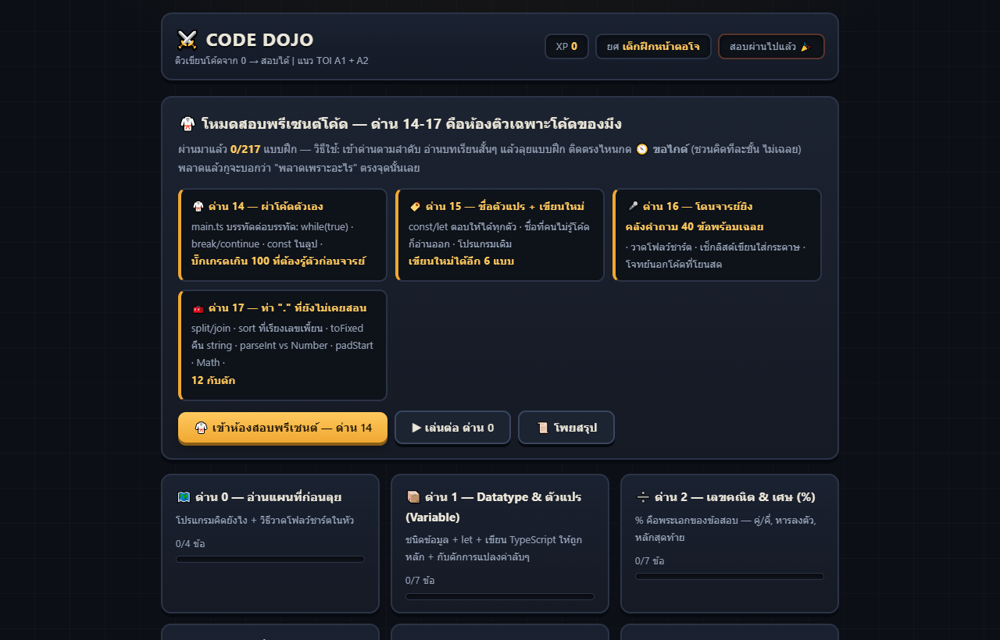

# Code Dojo

A coding drill site built to tutor classmates before a programming exam. The hosted version has since grown into a shared coding workspace.

## What is inside

- **217 exercises across 21 stages**, from variables and branching through algorithms and unit tests.
- **Progressive locks.** A stage opens after the previous one reaches 70%, making skipped fundamentals visible.
- **Explanations, not answer dumps.** Incorrect choices give a reason and a directional hint.
- **TOI A1/A2 practice** and a final 29-exercise unit-testing stage with a small browser test runner.
- **Responsive tables and code panels** verified across all 21 stages at desktop, tablet, and phone widths.
- **Readable code examples.** A custom TypeScript highlighter adds VS Code Dark+ style tokens and bracket-pair colours to the lessons and code editor. It is optional, so the exercises still run if the script cannot load.
- **Static exercise app.** The exercises need no packages or build step.

## New in the hosted version

The [live site](https://sakuraq-b7f96.web.app/dojo/) also has shared code and flowchart rooms. The code room supports simultaneous editing, separate user cursors, TypeScript diagnostics, saved run snapshots, and a browser terminal. The room and flowchart modules are part of the deployed site; this repository is the curated source for the standalone exercise app.

## Open it

- [Live site](https://sakuraq-b7f96.web.app/dojo/)
- Or download this repository and open `index.html` in a browser. Keep `lib/tsdark.js` beside it for syntax highlighting.

## Stack

HTML · CSS · JavaScript · no build step

## Honest notes

This was used in real tutoring sessions, but it has no usage analytics. The exercise count is generated from the current source rather than estimated from an older README.
